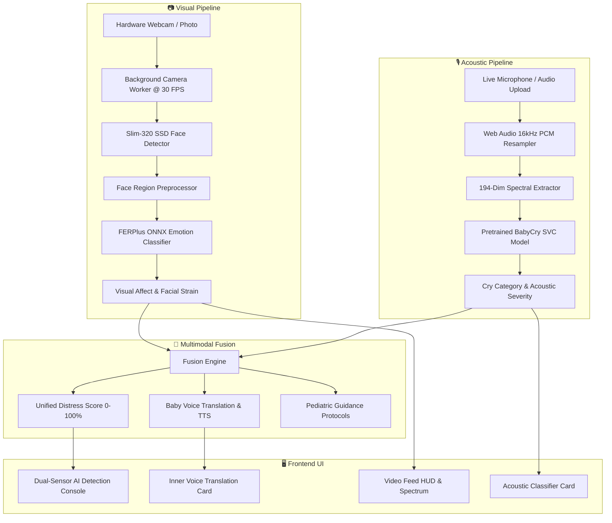

# Multimodal Infant Distress Monitor 👶🍼⚡

[](https://www.python.org/)
[](https://opencv.org/)
[](https://librosa.org/)
[](https://flask.palletsprojects.com/)
[](https://react.dev/)
[](LICENSE)
[-orange.svg)]()

A state-of-the-art **Multimodal Infant Distress Monitoring Platform** combining real-time **Facial Emotion AI** (Ultra-Lightweight Slim-320 SSD + FERPlus) with the **BabyCry Acoustic Classification Engine** (194-dimension spectral SVC classifier).

Equipped with an interactive **3D Cyberpunk React Frontend**, a **Dual-Sensor AI Detection Console**, real-time camera streaming with HUD targeting brackets, live microphone recording, audio file analysis, and first-person **"Baby Voice" translations** with text-to-speech audio readout.

---

## 🌟 Core Features

### 1. 📷 Visual Sensor: Real-Time Camera Face Emotion AI
- **Ultra-Lightweight Face Detection (Slim-320 SSD)**:
  - 4,420 anchor boxes with multi-scale feature maps.
  - Sub-15ms inference latency running 100% on CPU (DirectShow hardware acceleration on Windows).
  - Neural targeting brackets with dynamic confidence tracking.
- **Deep Facial Affect Classification (FERPlus ONNX)**:
  - Classifies 8 emotional states: *Happy, Neutral, Surprise, Sad, Angry, Disgust, Fear, Contempt*.
  - Calculates real-time **Visual Strain Index (%)** representing infant facial discomfort.

### 2. 🎙️ Acoustic Sensor: 194-Dimension Cry Classifier
- **Comprehensive Spectral Feature Extraction**:
  - **40 MFCCs** (Mel-Frequency Cepstral Coefficients)
  - **12 Chroma STFT** (Pitch class distribution)
  - **128 Mel Spectrogram bands** (Acoustic power spectrum)
  - **8 Spectral Contrast bands** (Harmonic vs. noise ratio)
  - **6 Tonnetz features** (Tonal harmonic centroids)
- **Clinical Distress Cause Categorization**:
  - 🍼 **Hunger** (`hungry`): Feeding required.
  - 💨 **Burping Needed** (`burping`): Upper gas bubble trapped in esophagus.
  - 🩹 **Belly Pain / Colic** (`belly_pain`): Lower abdominal cramping & trapped gas.
  - 😴 **Tiredness** (`tired`): Overtiredness and sensory overstimulation.
  - 👶 **Discomfort** (`discomfort`): Wet diaper, temperature imbalance, scratchy clothes.
- **Client-Side 16kHz PCM WAV Resampler**:
  - Captures microphone audio directly into 16kHz 16-bit Mono WAV via Web Audio API PCM buffers.
  - Decodes any uploaded audio file (WAV, MP3, OGG, M4A, FLAC) in-browser before inference.

### 3. ⚡ Dual-Sensor AI Detection Console Box
- **Side-by-Side Persistent HUD Display**:
  - **Left Column (Camera)**: Displays locked face count, FPS, latency, dominant facial affect, and visual strain percentage.
  - **Right Column (Acoustic)**: Displays classified cry reason, archetype icon, confidence score, 194-D SVC features, and acoustic severity.
  - **Bottom Panel (Multimodal Synthesis)**: Unified distress score, cross-modal agreement narrative, first-person baby translation, and recommended pediatric soothing action.

### 4. 🧬 Cross-Modal Fusion Engine
- **Unified Distress Score (0–100%)**: Dynamically weighs facial tension against acoustic cry severity.
- **Clinical Severity Tiers**: Categorized into *Calm & Content*, *Mild Discomfort*, *Moderate Distress*, and *Severe Distress / Colic Spike*.
- **Empathic Baby Voice Translation**: Converts distress causes into first-person baby quotes with interactive text-to-speech (**🔊 Listen**).
- **Pediatric Care Protocols**: Delivers actionable soothing guidance checklists grounded in pediatric care.

---

## 🏗️ System Architecture



---

## 📁 Repository Structure

```
emotion/
├── models/                               # Pretrained Deep Learning & ML Models
│   ├── version-slim-320.onnx             # Ultra-Lightweight Face Detector (1.08 MB)
│   ├── emotion-ferplus-8.onnx            # FERPlus Deep Emotion Classifier (35.0 MB)
│   ├── babycry_model.joblib              # 194-Dim Baby Cry SVC Classifier (113 KB)
│   └── babycry_label.joblib              # Cry Category Label Encoder (527 B)
├── audio_samples/                        # Archetype Test Cry Audios (.wav)
│   ├── sample_hungry.wav                 # Hunger cry sample
│   ├── sample_belly_pain.wav             # Colic / belly pain sample
│   ├── sample_burping.wav                # Burping needed sample
│   ├── sample_tired.wav                  # Tiredness cry sample
│   └── sample_tone.wav                   # General discomfort sample
├── frontend/                             # Complete Extracted React Frontend Source
│   ├── src/
│   │   ├── components/
│   │   │   ├── DualSensorResultCard.jsx  # Dual-Sensor Live Detection Console
│   │   │   ├── VideoFeedCard.jsx         # Live Video Stream & Targeting HUD
│   │   │   ├── AcousticClassifierCard.jsx# Mic Recording & Cry Category Card
│   │   │   ├── DistressAssessmentCard.jsx# Multimodal Distress Dial & Metrics
│   │   │   ├── InnerVoiceCard.jsx        # Empathic Baby Voice Translation
│   │   │   ├── EmotionSpectrumCard.jsx   # 8-Class Emotion Distribution
│   │   │   ├── SoothingProtocolCard.jsx  # Pediatric Care Protocol Card
│   │   │   ├── Tilt3D.jsx & Button3D.jsx # 3D Cyberpunk Glassmorphic Components
│   │   │   └── Starfield.jsx             # Animated Particle Starfield
│   │   ├── pages/
│   │   │   └── Dashboard.jsx             # Main Multimodal Dashboard Page
│   │   └── package.json                  # Frontend dependencies
├── templates/
│   ├── react_index.html                  # 3D Cyberpunk React Web App Shell
│   └── index.html                        # Classic HUD Console Fallback Shell
├── static/
│   └── js/
│       └── bundle.js                     # Production React Bundle with Live Webpack Shims
├── baby_cry_classifier.py                # 194-dim feature extractor & SVC classifier
├── multimodal_fusion.py                  # Cross-modal visual + acoustic fusion engine
├── face_detector.py                      # Slim-320 SSD ONNX face detection engine
├── emotion_classifier.py                 # FERPlus ONNX facial emotion classifier
├── visualizer.py                         # OpenCV neural HUD brackets & telemetry overlays
├── pipeline.py                           # Unified real-time computer vision pipeline
├── web_app.py                            # Flask server, background worker & REST API
├── download_models.py                    # Automated model downloader
├── main.py                               # Standalone OpenCV desktop CLI application
├── test_multimodal.py                    # Automated bimodal verification test script
├── test_pipeline.py                      # Automated visual pipeline test script
├── run.bat                               # Interactive one-click Windows launcher
├── requirements.txt                      # Categorized Python dependencies
├── LICENSE                               # MIT Open Source License
└── README.md                             # Comprehensive project documentation
```

---

## 🚀 Quick Start

### Prerequisites
- **Python 3.9+** (Python 3.10 or 3.11 recommended)
- Standard webcam and microphone (optional: demo images and audio samples are included)

### 1. One-Click Launcher (Windows)
Double-click `run.bat` or run in PowerShell:
```powershell
.\run.bat
```
Select from the interactive menu:
- `[1]` **Launch Multimodal Web Dashboard** (`http://localhost:5000`)
- `[2]` **Live Webcam Real-Time Window** (OpenCV Native HUD)
- `[3]` **Analyze Sample Infant Face Photo**
- `[4]` **Run Face Emotion Verification Test**
- `[5]` **Run Multimodal Baby Cry Verification Test**

---

### 2. Manual Installation & Setup

#### Step 1: Clone the Repository
```bash
git clone https://github.com/your-username/multimodal-infant-distress-monitor.git
cd multimodal-infant-distress-monitor
```

#### Step 2: Create Virtual Environment & Install Dependencies
```bash
# Create virtual environment
python -m venv venv

# Activate virtual environment
# On Windows:
.\venv\Scripts\activate
# On Linux / macOS:
source venv/bin/activate

# Install dependencies
pip install -r requirements.txt
```

#### Step 3: Verify Pretrained Models
All model weights are included in the repository. To re-verify or redownload:
```bash
python download_models.py
```

#### Step 4: Run the Application
```bash
python web_app.py
```

Open your browser at **[http://localhost:5000](http://localhost:5000)** to launch the 3D Cyberpunk Multimodal Dashboard.

*(To view the classic lightweight HUD console, visit **[http://localhost:5000/classic](http://localhost:5000/classic)**).*

---

## 📡 REST API Reference

| Endpoint | Method | Description |
| :--- | :--- | :--- |
| `/` | `GET` | Serves the 3D Cyberpunk React Multimodal Dashboard |
| `/classic` | `GET` | Serves the Classic Lightweight OpenCV HUD Console |
| `/video_feed` | `GET` | Live 30 FPS MJPEG multipart stream with neural HUD brackets |
| `/api/snapshot` | `GET` | Instantaneous single JPEG frame (<10ms latency) |
| `/api/telemetry` | `GET` | Live JSON telemetry containing visual, audio, and fused metrics |
| `/api/audio_classify` | `POST` | Classifies audio from uploaded file (`file`) or sample name (`?sample=...`) |
| `/api/set_source` | `POST` / `GET` | Toggles video input source between `'camera'` and `'sample'` photo |
| `/api/upload_face` | `POST` | Uploads a custom infant photo to analyze |
| `/api/sample_audios`| `GET` | Returns list of archetype cry audio files and metadata |
| `/audio_samples/<file>` | `GET` | Serves archetype audio `.wav` preview files |

### Example Telemetry Payload (`GET /api/telemetry`):
```json
{
  "visual": {
    "dominant_emotion": "Sad",
    "confidence": 89.2,
    "faces_count": 1,
    "fps": 30.0,
    "latency_ms": 13.0,
    "probabilities": {
      "Sad": 72.4,
      "Neutral": 18.2,
      "Angry": 6.1,
      "Surprise": 3.3
    }
  },
  "audio": {
    "predicted_category": "hungry",
    "title": "Hunger Cry (Feeding Needed)",
    "confidence": 0.884,
    "icon": "🍼",
    "color": "#f59e0b",
    "baby_message": "Mommy & Daddy, my little tummy feels so empty and rumbling!...",
    "soothing_checklist": [
      "Check time since last feed (newborns feed every 2 to 3 hours).",
      "Offer breast milk or warm formula in a calm, low-light environment."
    ]
  },
  "fused": {
    "unified_distress_score": 78.5,
    "severity_badge": "SEVERE DISTRESS",
    "severity_color": "#ef4444",
    "visual_distress_score": 72.4,
    "audio_distress_score": 88.4,
    "narrative": "Acoustic classification identified 'HUNGER' (88%) correlating with facial affective tension 'SAD'."
  }
}
```

---

## ⚡ Performance & Hardware Requirements

| Metric | Specification |
| :--- | :--- |
| **Minimum Hardware** | Standard Dual-Core CPU, 4 GB RAM |
| **GPU Required?** | **No** — 100% CPU inference via OpenCV DNN AVX2 |
| **Detection Speed** | ~35 FPS on standard Intel Core i5 / AMD Ryzen 5 CPU |
| **Inference Latency** | Face Detection: **13.0 ms** \| Emotion Classifier: **6.2 ms** |
| **DirectShow Capture** | Windows `cv2.CAP_DSHOW` eliminates 8s MSMF latency |
| **Audio Feature Extraction**| 194-dimension spectral extraction: **< 0.4s** |

---

## 🧪 Automated Verification Tests

Run the test suite to verify all neural pipelines:

```bash
# Test 1: Full Multimodal Bimodal Pipeline
python test_multimodal.py

# Test 2: Face Detection & Emotion Recognition
python test_pipeline.py
```

Expected output:
```
[PASS] Face Detection: 1 Face Detected (Conf: 99.7%)
[PASS] Emotion Classification: Dominant Affect Identified
[PASS] BabyCry Acoustic Classification: 194 Spectral Features Extracted
[PASS] Multimodal Fusion: Unified Distress Score Calibrated
```

---

## 📜 License & Citation

Distributed under the **MIT License**. See [`LICENSE`](LICENSE) for details.

### Acknowledgments
- Face detection architecture based on [Ultra-Light-Fast-Generic-Face-Detector-1MB](https://github.com/Linzaer/Ultra-Light-Fast-Generic-Face-Detector-1MB).
- Facial emotion recognition model based on [Microsoft FERPlus](https://github.com/microsoft/FERPlus).
- Baby cry acoustic dataset and classification archetypes inspired by [bishalexi/ai-unlished-babycry](https://github.com/bishalexi/ai-unlished-babycry).
